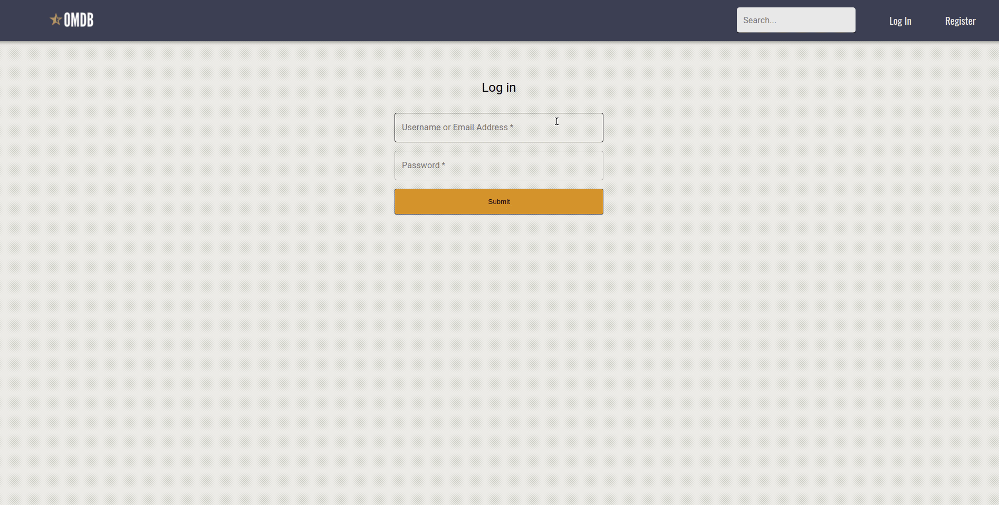

# OMDB Open Movie Database

Web application that uses the OMDB API to obtain movie information and let the user search, display and add movies to favorites.

## Demo

## Built with

- Node.js
- Express
- React
- React router
- Material UI

## Usage

- Clone the repo
- Install using npm: npm install
- Start using npm: npm start
